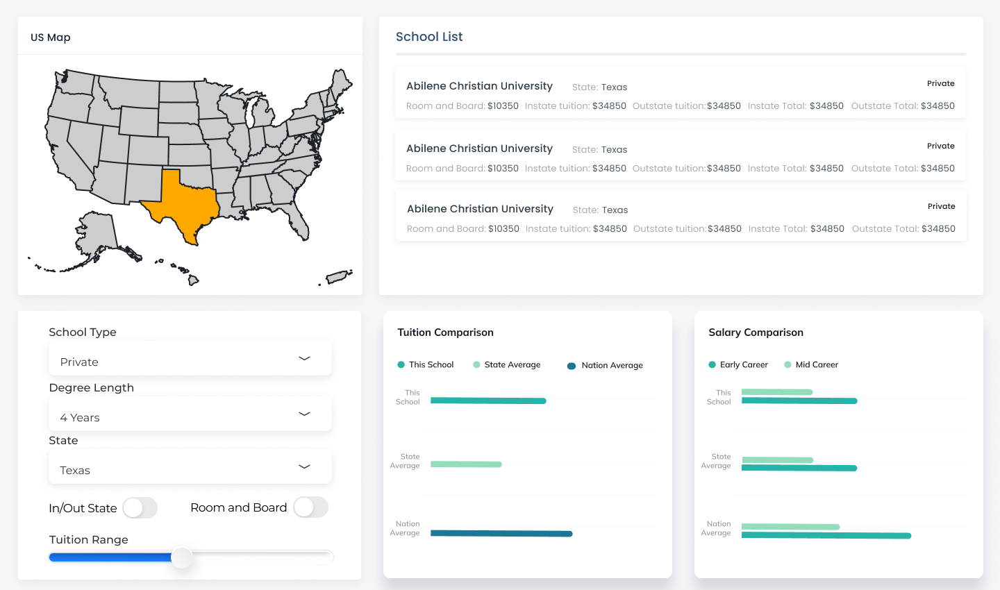
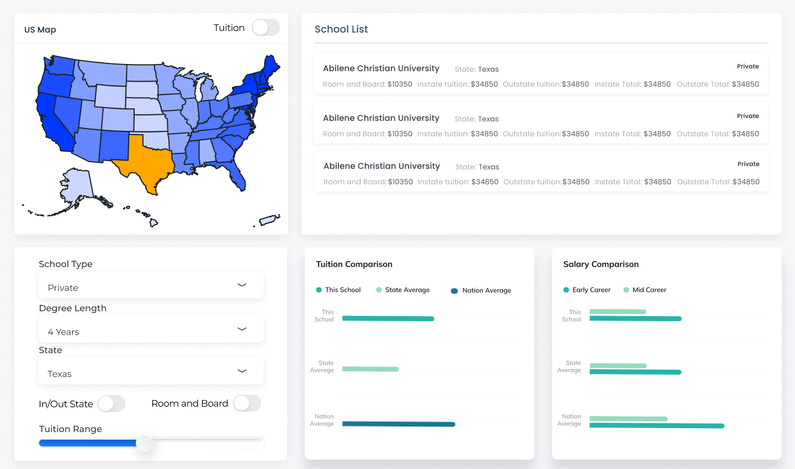

# {School Tuition and Salary Dashboard} (Group H)

- Your title can change over time.
- Here you should add the problem this dashboard hopes to solve

## Team Members

- Person 1: Can Jiang
- Person 2: Bowen Yang
- Person 3: Navdeep Singh Saini

## Describe your topic/interest in about 150-200 words

{Add your stuff here}

## About this Dashboard

### Simple Version

### Description of our app & sketch

The app contains a U.S. map that shows all the states. The map is interactive and users can click on a state to show the information for that state. Below the map is a filter menu which can be used to adjust which schools will be displayed according to several selecting criteria (school type, degree length, state, in/out state, whether it has room & board and tuition range). A list of all the schools that meet the selecting criteria will be displayed in the top-right box, showing the detailed cost for that school. Below the school list are two bar chart, comparing the selected school's tuition and the projected salary potential with the state average and nation average.

### Advanced Version

### Description of our app & sketch

This version include all features in the "Simple Version", and also contains a heat map for showing average tuition cost / salary of graduates of each state.

## Acknowledgements and references 

