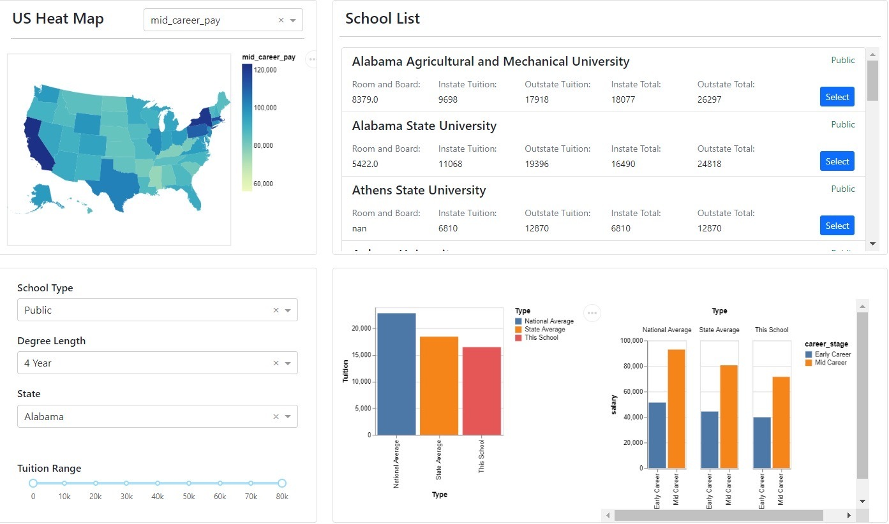

# US School Finder (Group H)

## Dashboard Deployment Links and Repositories

| Link      | Repository |
| ----------- | ----------- |
| [Link to the Group Deployment](https://us-school-finder.herokuapp.com/)     | [Repo](https://github.com/ubco-mds-2021-labs/dashboard1-data551_group-h)       |
| [Link to Navdeep's Deployment](https://us-school-finder-navdeep.herokuapp.com/)   | [Repo](https://github.com/navdeep94/dashboard1-data551_group-h/tree/main)        |
| [Link to Bowen's Deployment](https://us-school-finder-bowen.herokuapp.com/)   | [Repo](https://github.com/boweny0319/dashboard1-data551_group-h/tree/main)        |
| [Link to Can's Deployment](https://us-school-finder-can.herokuapp.com/)   | [Repo](https://github.com/CenatexCJ/dashboard1-data551_group-h/tree/main)       |

## Goals

- The dashboard helps the students and their guardians in selecting schools for higher education based on all the analysis taken into the consideration across various states of the United States.
- It will help them to make better decisions for the school selection considering tuition fees, salaries, state etc

## Team Members

- Can Jiang
- Bowen Yang
- Navdeep Singh Saini

## Describe your topic/interest in about 150-200 words

In United States, we have lot of parents who are worried about the future prospects of their children especially after high school or undergrad in terms of university selection to pursue higher studies. But for them it is very difficult to decide which institutions to prefer because of lesser knowledge and complex factors involved. As a result, they eventually take the services of a very famous Educational Advisory firm situated in New York which helps them in selecting institutions/universities based on various factors like tuition fees, region, salary after graduation, type etc. The firm has hired us as a Data Scientists of team of three to come up with an overall visualizations and Dashboard providing some quality Analysis/patterns based on which they can provide some useful and quality suggestions for their clients

We will be visualizing a dataset of approximately 3,000 colleges & universities across the United States. Each university has a number of variables that describe the state where the school is located (state, state_code), the type of school (public, private, for-profit), the degree_length of the program (4-year, 2-year), and the cost of the program (room_and_board, in_state_tuition, in_state_total, out_of_state_tuition, out_of_state_total). We will also integrate another dataset that contains the salary potential for about 1,000 schools. We will join these 2 datasets together by school name and use the joined dataset for the visualization.

## About this Dashboard

## Description of our app & sketch

The app contains a U.S. map that shows all the states. The map is interactive and users can click on a state to show the information for that state. Below the map is a filter menu which can be used to adjust which schools will be displayed according to several selecting criteria (school type, degree length, state, in/out state, whether it has room & board and tuition range). A list of all the schools that meet the selecting criteria will be displayed in the top-right box, showing the detailed cost for that school. Below the school list are two bar chart, comparing the selected school's tuition and the projected salary potential with the state average and nation average.

## Dashboard Usage Example

Once you open the heroku dahsboard app from one of the four links stated above, you can use the below test case in the filters dropdown to test the functionality of the app:

- School Type: Public
- Degree Length: 4 Year
- State: Alabama
- Tuition Range: 10K - 50K
- Click on Select on 'Alabama State University'
- Heatmap Dropdown - Choose any of the filters to see the reflection on Heatmap

Below is the snapshot of the dashboard that will look:

## Developer Notes

If you are interested in contributing to our application, please let us know through emails. We would like some expert's opinions on the funcationality and UI of the dashboard. Here is a demo on how to run our application locally:

- Clone the project from Github.
- Install dependencies on your local computer for this project.
- Open a terminal in the project, run python app.py in the src folder, then navigate to localhost:8050 in your web browser to see the running application.

